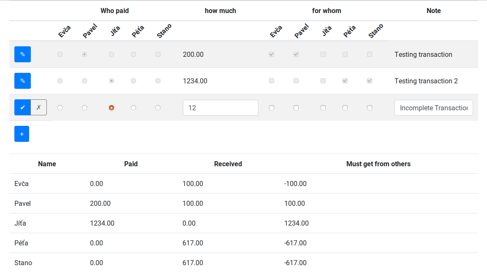

# Accounting

Web application for sorting out payments after a group vacation, implemented
using
[Purescript-Concur](https://github.com/ajnsit/purescript-concur).

It allows the user to write down who paid what for whom, and the application will
calculate which transactions must be made to even everything out. This
functionality can be easily replicated in any spreadsheet program,
but I got tired of making these spreadsheets and decided to make a simple
web app.

The basic client-side functionality is implemented, but the site is still
missing server-side code for session persistence. This means that **this
project is still not ready for use**.



## Building

Grab the code

```
git clone https://github.com/ajnsit/purescript-concur-starter.git
```

Build the project. `node` and `npm` must be installed.

```
npm install
npm run dev
```

### Run Development Server

```
npm start
```

At the end of the previous command, you will have a development server
which will watch for changes, and automatically reload the web page.
This mechanism only works with JS changes.

However, in practice, your IDE should automatically recompile Purescript to
Javascript on every change, which will be picked up by the development server.
So you get immediate recompilation even with Purescript.

<!-- ### Build production artifacts

> npm run prod -->
